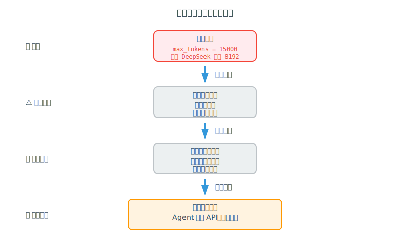
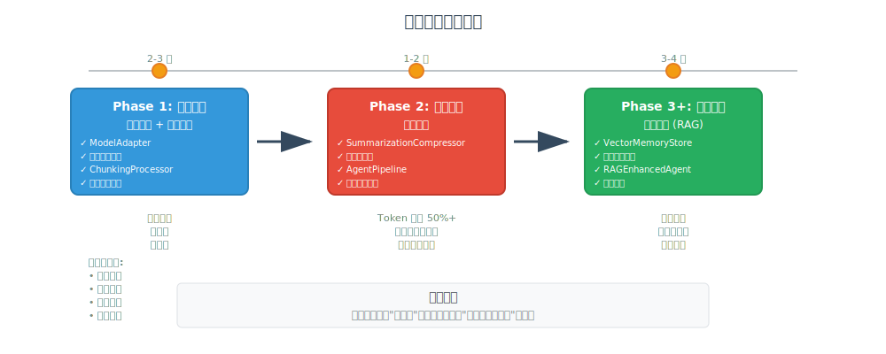
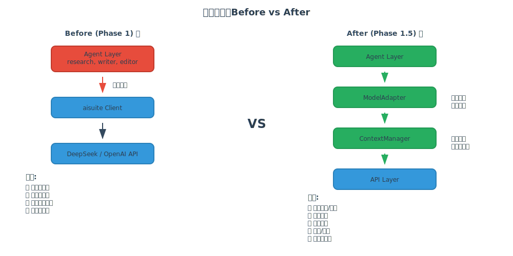
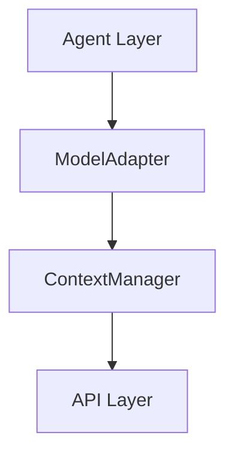

# 博客图表创建完成总结

## ✅ 已完成的工作

### 1. SVG 图表（3个）

位置：`docs/blog/images/`

| 文件名 | 描述 | 尺寸 | 用途 |
|--------|------|------|------|
| `problem-evolution.svg` | 问题演进：从表象到根本 | 800x450 | 展示问题分析的四个层次 |
| `architecture-evolution.svg` | 架构演进：Before vs After | 1000x500 | 对比改进前后的架构 |
| `phased-implementation-roadmap.svg` | 分阶段实施路线图 | 1000x400 | 展示三个阶段的实施计划 |

**特点**：
- ✅ 矢量图，可无损缩放
- ✅ 中文标注，清晰易懂
- ✅ 配色专业，视觉友好
- ✅ 可直接在博客中使用

### 2. Mermaid 图表（5个）

位置：`docs/blog/diagrams/mermaid/`

| 文件名 | 描述 | 类型 |
|--------|------|------|
| `01-problem-evolution.mmd` | 问题演进流程 | 流程图 |
| `02-architecture-comparison.mmd` | 架构对比 | 子图对比 |
| `03-data-flow.mmd` | 数据流图 | 流程图 |
| `06-model-adapter-flow.mmd` | ModelAdapter 工作流 | 流程图 |
| `07-chunking-process.mmd` | 分块处理流程 | 流程图 |

**特点**：
- ✅ GitHub 原生支持
- ✅ 可在 Markdown 中直接渲染
- ✅ 易于修改和维护
- ✅ 适合技术文档

### 3. 配套文档（4个）

| 文件名 | 描述 |
|--------|------|
| `docs/blog/images/README.md` | SVG 图表使用说明 |
| `docs/blog/diagrams/diagrams.md` | 所有图表的 Mermaid 代码 |
| `docs/blog/diagrams/insertion-guide.md` | 图表插入指南 |
| `docs/blog/HOW_TO_USE_DIAGRAMS.md` | 完整使用教程 |

### 4. 工具脚本（1个）

| 文件名 | 描述 |
|--------|------|
| `docs/blog/diagrams/generate-images.sh` | 图表生成脚本（Mermaid → PNG） |

## 📊 图表覆盖的内容

### 问题分析部分
- ✅ 问题演进的四个层次（表象 → 根本）
- ✅ 架构设计的缺陷

### 解决方案部分
- ✅ Before/After 架构对比
- ✅ 三种方案的对比
- ✅ 分阶段实施路线图

### 技术实现部分
- ✅ ModelAdapter 工作流程
- ✅ ChunkingProcessor 处理流程
- ✅ 数据流向

## 🎯 使用建议

### 在博客文章中插入

#### 第二部分：冰山之下 🧊

在 "根本原因：架构的'原罪'" 后插入：

```markdown

```

#### 第三部分：三条路的抉择 🛤️

在 "最终决策" 后插入：

```markdown

```

#### 第四部分：我们的实践 🛠️

在 "架构演进对比" 小节插入：

```markdown

```

### 在 GitHub README 中使用

使用 Mermaid 代码块：

````markdown

````

## 📁 文件结构

```
docs/blog/
├── context-length-management-journey.md  # 博客文章
├── HOW_TO_USE_DIAGRAMS.md               # 使用教程
├── DIAGRAM_COMPLETION_SUMMARY.md        # 本文件
├── images/                               # SVG 图表
│   ├── README.md
│   ├── problem-evolution.svg
│   ├── architecture-evolution.svg
│   └── phased-implementation-roadmap.svg
└── diagrams/                             # Mermaid 图表
    ├── diagrams.md
    ├── insertion-guide.md
    ├── generate-images.sh
    └── mermaid/
        ├── 01-problem-evolution.mmd
        ├── 02-architecture-comparison.mmd
        ├── 03-data-flow.mmd
        ├── 06-model-adapter-flow.mmd
        └── 07-chunking-process.mmd
```

## ✨ 图表特色

### 1. 专业的视觉设计

- **配色方案**：
  - 蓝色 (#3498db)：正常流程
  - 红色 (#e74c3c)：问题/错误
  - 绿色 (#27ae60)：解决方案
  - 橙色 (#f39c12)：警告/里程碑

- **字体选择**：
  - 标题：18px bold sans-serif
  - 正文：12px sans-serif
  - 代码：monospace

### 2. 清晰的信息层次

- **问题演进图**：
  - 4 个层次：表象 → 直接原因 → 深层原因 → 根本原因
  - 侧边标注：❌ 症状、⚠️ 直接原因、🔍 深层原因、🎯 根本原因

- **架构对比图**：
  - 左右对比：Before vs After
  - 问题列表 vs 改进列表
  - 直观展示架构演进

- **路线图**：
  - 3 个阶段：Phase 1 → Phase 2 → Phase 3+
  - 时间线：2-3天 → 1-2周 → 3-4周
  - 核心洞察：选择"最合适"而非"最好"

### 3. 易于理解的设计

- **箭头流向**：清晰的因果关系
- **颜色编码**：问题用红色，解决方案用绿色
- **文字说明**：关键点都有文字标注
- **图例说明**：复杂图表提供图例

## 🚀 下一步行动

### 立即可做

1. **在博客文章中插入图表**
   ```bash
   # 编辑博客文章
   vim docs/blog/context-length-management-journey.md
   
   # 在建议的位置插入图表引用
   
   ```

2. **预览效果**
   - 如果使用 Markdown 编辑器，可以直接预览
   - 如果使用静态博客生成器，运行本地服务器查看

3. **发布到博客平台**
   - 复制文章内容
   - 上传 SVG 图片
   - 调整图片引用路径

### 可选优化

1. **转换为 PNG**（如果平台不支持 SVG）
   ```bash
   cd docs/blog/diagrams
   chmod +x generate-images.sh
   ./generate-images.sh
   ```

2. **创建深色模式版本**
   - 修改 SVG 配色方案
   - 创建 `-dark.svg` 版本

3. **添加交互效果**
   - 使用 JavaScript 添加点击/悬停效果
   - 适合个人网站使用

## 📝 维护建议

### 更新图表

1. **修改 SVG**：
   - 直接编辑 `.svg` 文件
   - 或使用 Inkscape/Figma 等工具

2. **修改 Mermaid**：
   - 编辑 `.mmd` 文件
   - 在 Mermaid Live Editor 预览：https://mermaid.live/

3. **保持一致性**：
   - 使用相同的配色方案
   - 保持相同的字体大小
   - 统一的视觉风格

### 版本控制

```bash
# 提交图表文件
git add docs/blog/images/*.svg
git add docs/blog/diagrams/mermaid/*.mmd
git commit -m "Add technical diagrams for blog post"
git push
```

## 🎉 总结

我们已经完成了：

- ✅ 3 个高质量 SVG 图表
- ✅ 5 个 Mermaid 流程图
- ✅ 4 个配套文档
- ✅ 1 个工具脚本

**所有图表都已准备就绪，可以直接在博客中使用！**

---

**创建日期**: 2025-10-31  
**最后更新**: 2025-10-31  
**状态**: ✅ 完成
