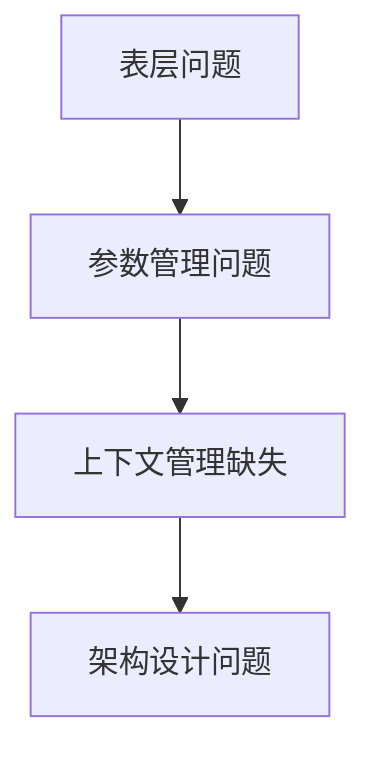
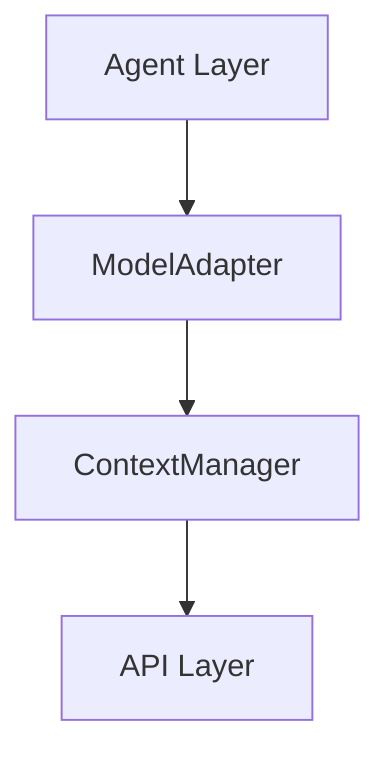

# 如何在博客中使用图表

本指南说明如何在博客文章中插入已创建的技术图表。

## 可用图表

### SVG 图表（推荐用于博客）

位置：`docs/blog/images/`

1. **problem-evolution.svg** - 问题演进图
2. **architecture-evolution.svg** - 架构演进对比图  
3. **phased-implementation-roadmap.svg** - 分阶段实施路线图

### Mermaid 图表（推荐用于 GitHub）

位置：`docs/blog/diagrams/mermaid/`

1. **01-problem-evolution.mmd** - 问题演进流程
2. **02-architecture-comparison.mmd** - 架构对比
3. **03-data-flow.mmd** - 数据流图
4. **06-model-adapter-flow.mmd** - ModelAdapter 工作流
5. **07-chunking-process.mmd** - 分块处理流程

## 插入方法

### 方法 1：Markdown 图片语法（最简单）

```markdown

```

### 方法 2：HTML img 标签（可控制大小）

```html

```

### 方法 3：Mermaid 代码块（GitHub/支持的平台）

````markdown

````

## 建议的插入位置

### 第二部分：冰山之下 🧊

在 "根本原因：架构的'原罪'" 小节后插入：

```markdown
### 根本原因：架构的"原罪"

画出当前的架构图，问题一目了然：


**缺失的东西**：
- ❌ 没有参数验证层
...
```

### 第三部分：三条路的抉择 🛤️

在 "最终决策" 小节后插入：

```markdown
**最终决策**：

> "我们采用**分阶段实施策略**！"


**关键洞察**：
...
```

### 第四部分：我们的实践 🛠️

在 "架构演进对比" 小节插入：

```markdown
### 架构演进对比

**Before vs After**:


**改进点**：
- ✅ 统一的参数管理
...
```

## 在不同平台使用

### GitHub README

GitHub 原生支持 Mermaid，推荐使用 `.mmd` 文件：

````markdown

````

### 博客平台（Medium, Dev.to, 掘金等）

大多数博客平台支持 Markdown 图片语法，使用 SVG：

```markdown

```

### 个人网站/静态博客（Hugo, Jekyll, Hexo）

将 SVG 文件复制到静态资源目录：

```bash
# Hugo
cp docs/blog/images/*.svg static/images/

# Jekyll
cp docs/blog/images/*.svg assets/images/

# Hexo
cp docs/blog/images/*.svg source/images/
```

然后在文章中引用：

```markdown

```

## 转换为 PNG（如果需要）

某些平台不支持 SVG，可以转换为 PNG：

### 使用 Inkscape（命令行）

```bash
# 安装 Inkscape
brew install inkscape  # macOS
sudo apt install inkscape  # Linux

# 转换
inkscape problem-evolution.svg --export-png=problem-evolution.png --export-width=1600
```

### 使用在线工具

- https://cloudconvert.com/svg-to-png
- https://svgtopng.com/
- https://convertio.co/svg-png/

### 使用 Node.js 脚本

参考 `docs/blog/diagrams/generate-images.sh`

## 图表尺寸建议

| 图表类型 | 建议宽度 | 建议高度 |
|---------|---------|---------|
| 流程图 | 800px | 400-600px |
| 架构图 | 1000px | 500px |
| 路线图 | 1000px | 400px |

## 优化建议

### 1. 响应式设计

```html

```

### 2. 深色模式适配

如果你的博客支持深色模式，考虑提供两个版本：

```markdown


```

### 3. 懒加载

```html

```

## 常见问题

### Q: SVG 在某些平台显示不正常？

A: 尝试转换为 PNG 格式，或检查 SVG 是否包含外部字体引用。

### Q: Mermaid 图表渲染失败？

A: 确保平台支持 Mermaid，或使用 SVG 版本。

### Q: 图表太大/太小？

A: 使用 HTML img 标签的 width 属性调整大小。

### Q: 如何在微信公众号使用？

A: 微信公众号不支持 SVG，需要转换为 PNG/JPG 格式。

## 更多资源

- [Mermaid 官方文档](https://mermaid.js.org/)
- [SVG 优化工具 SVGO](https://github.com/svg/svgo)
- [图表设计最佳实践](https://www.interaction-design.org/literature/article/information-visualization)

---

**提示**：如果你在使用过程中遇到问题，欢迎在 GitHub Issues 中提问！
