# 博客文章配图 - Mermaid 图表

本文件包含博客文章中使用的所有图表的 Mermaid 代码。

---

## 1. 问题演进图

**用途**: 展示从表层问题到根本原因的分析过程

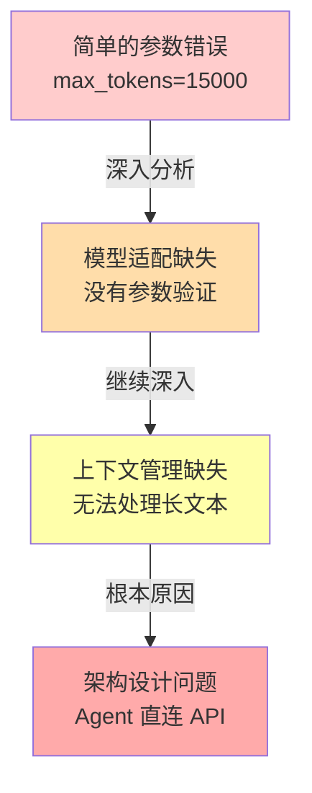

---

## 2. 当前架构 vs 目标架构对比

**用途**: 对比 Phase 1 和 Phase 1.5 的架构差异

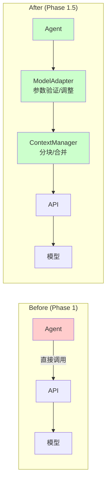

---

## 3. 数据流分析图

**用途**: 展示数据在 Agent 间的传递和累积

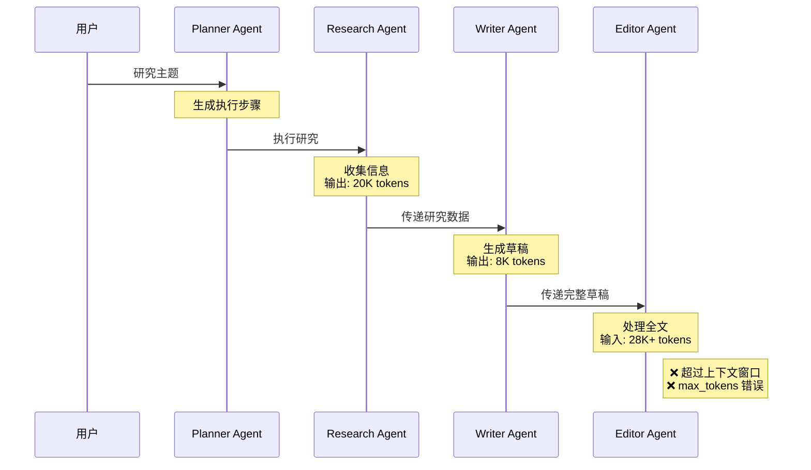

---

## 4. 三种方案对比雷达图

**用途**: 可视化三种方案的优劣势

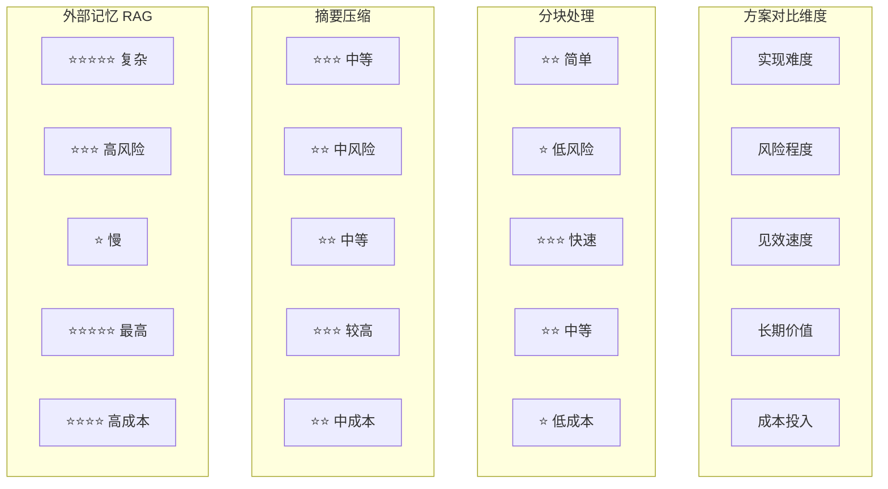

---

## 5. 分阶段实施路线图

**用途**: 展示渐进式改进的策略

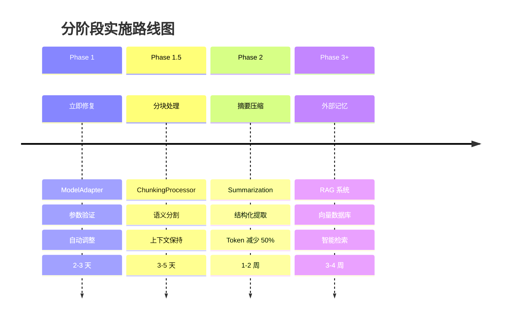

---

## 6. ModelAdapter 工作流程

**用途**: 展示 ModelAdapter 的参数验证和调整流程

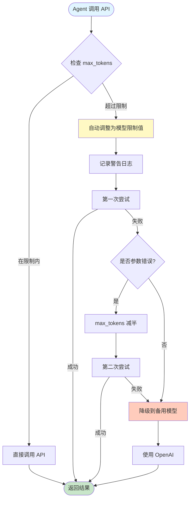

---

## 7. ChunkingProcessor 处理流程

**用途**: 展示分块处理的完整流程

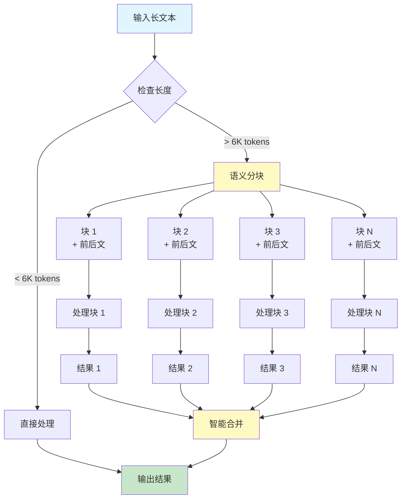

---

## 8. 成本对比柱状图

**用途**: 可视化成本节省效果

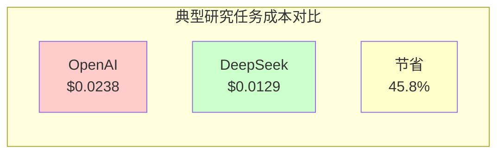

---

## 9. 测试覆盖率进化

**用途**: 展示测试覆盖率的提升

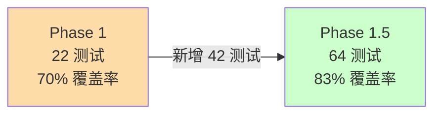

---

## 10. 错误恢复机制流程

**用途**: 展示增强的降级机制

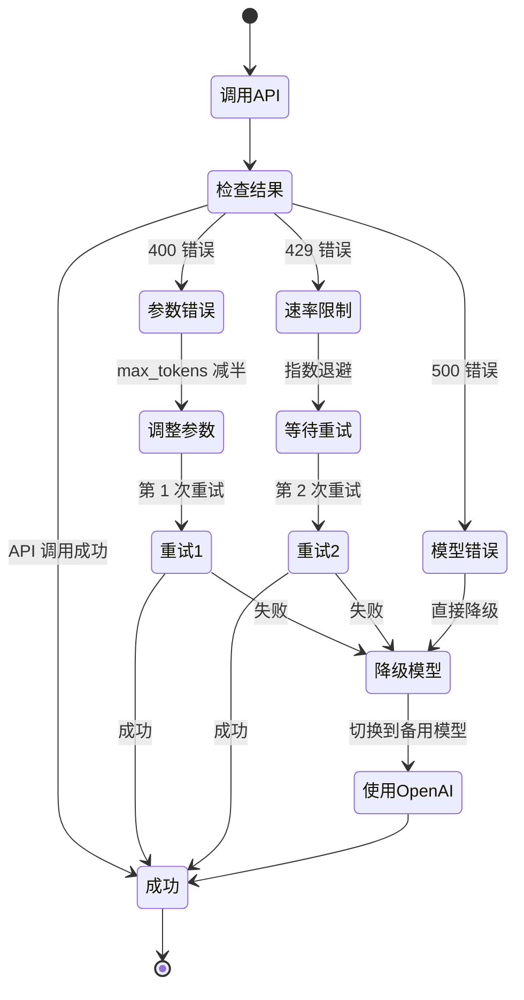

---

## 11. 上下文管理分层架构

**用途**: 展示未来的分层上下文管理设计

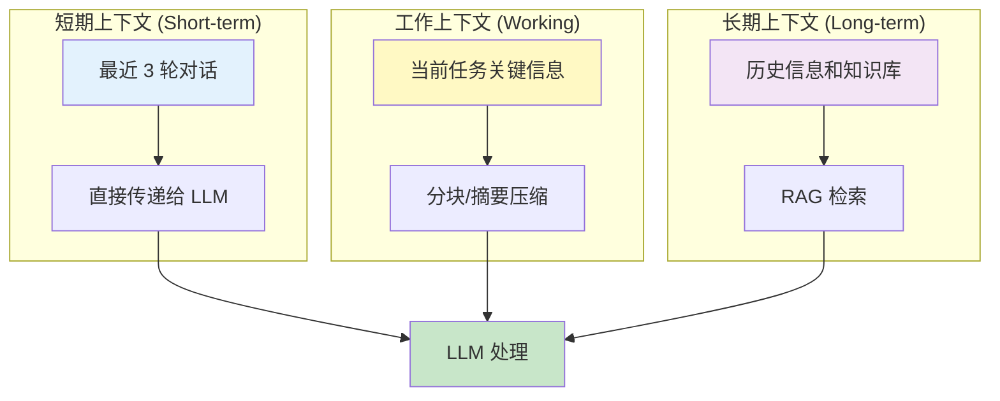

---

## 12. 处理时间对比

**用途**: 展示不同文本长度的处理时间开销

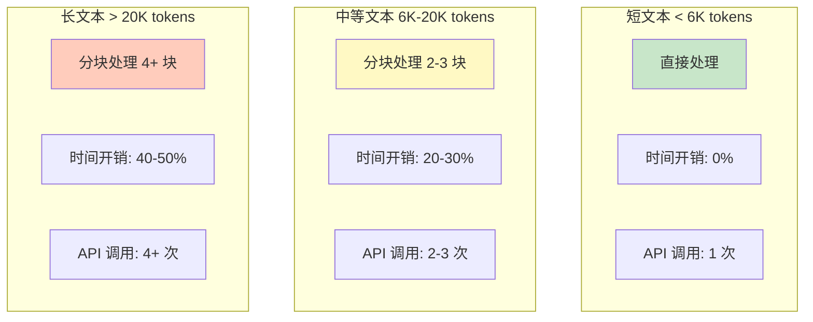

---

## 使用说明

### 在 Markdown 中使用

直接将 Mermaid 代码块复制到 Markdown 文件中：

\`\`\`mermaid
[Mermaid 代码]
\`\`\`

### 生成 SVG 图片

使用 Mermaid CLI 或在线工具：

1. **Mermaid Live Editor**: https://mermaid.live/
2. **Mermaid CLI**:
   ```bash
   npm install -g @mermaid-js/mermaid-cli
   mmdc -i diagram.mmd -o diagram.svg
   ```

### 支持的平台

- GitHub (原生支持)
- GitLab (原生支持)
- 掘金 (支持)
- 知乎 (需要转换为图片)
- CSDN (需要转换为图片)

---

**创建日期**: 2025-10-31  
**维护者**: AI Research Assistant Team
